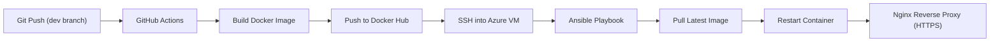
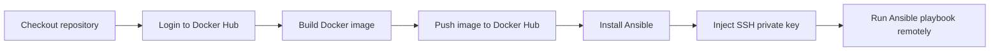

# Automated Azure Deployment with Terraform, Ansible & GitHub Actions

## Project Overview

This project demonstrates an end-to-end automated deployment pipeline for a containerised Spring Boot application using:

Terraform – Infrastructure as Code (IaC)

Microsoft Azure – Cloud infrastructure provider

Docker & Docker Hub – Containerisation and image registry

Ansible – Configuration management and application deployment

GitHub Actions – Continuous Integration / Continuous Deployment (CI/CD)

Nginx + Let’s Encrypt – Reverse proxy and HTTPS

The system provisions a secure Azure Virtual Machine, configures Docker and Nginx automatically, deploys a Spring Boot application container, and enables HTTPS using a trusted certificate.

### Architecture Overview

### Azure Resources Provisioned (via Terraform)
Resource Group,
Virtual Network (10.10.0.0/16),
Subnet (10.10.1.0/24),
Network Security Group,
SSH (22) restricted,
HTTP (80) open,
HTTPS (443) open,
Static Public IP,
Azure DNS Label,
Ubuntu 24.04 LTS Virtual Machine

#### Technologies Used

| Tool            | Purpose                              |
|-----------------|--------------------------------------|
| Terraform       | Infrastructure provisioning          |
| Azure CLI       | Authentication & cloud management    |
| Docker          | Containerisation                     |
| Docker Hub      | Image registry                       |
| Ansible         | VM configuration & deployment        |
| GitHub Actions  | CI/CD automation                     |
| Nginx           | Reverse proxy                        |
| Certbot         | HTTPS certificate management         |

⚙️ Infrastructure Setup (Terraform)

1️⃣ Install Terraform "winget install HashiCorp.Terraform"

2️⃣ Install Azure CLI "winget install --exact --id Microsoft.AzureCLI"

3️⃣ Login to Azure "az login"

After logging in, note your Subscription ID (required in the Terraform provider block).

4️⃣ Initialise Terraform Inside the terraform directory "terraform init". 
This installs required providers (AzureRM).

5️⃣ Review Planned Resources "terraform plan"
This displays how many Azure resources will be created.

6️⃣ Apply Infrastructure "terraform apply"
When prompted, paste your SSH public key.

Provisioning takes some seconds.

### Application Containerisation
1️⃣ A simple Spring Boot web application running on port 8080

2️⃣ Build Docker Image "docker build -t webapp:latest ."

3️⃣ Login to Docker Hub "docker login"

4️⃣ Tag Image "docker tag webapp:latest {username}/webapp:latest"

5️⃣ Push to Docker Hub "docker push {username}/webapp:latest"

The image is now publicly accessible for deployment.

### Configuration Management (Ansible)

Since Ansible does not run natively on Windows, Windows Subsystem for Linux (WSL) was used.

1️⃣ Install WSL "wsl --install"
Set Linux username and password.

2️⃣ Install Ansible "sudo apt update" then "sudo apt install ansible"

If python is not installed "sudo apt install -y python3-pip"

3️⃣ Configure SSH Key in WSL

Copy your private key from Windows "mkdir -p ~/.ssh", 
"cp /mnt/c/Users/{USERNAME}/.ssh/id_ed25519 ~/.ssh/", 
"chmod 600 ~/.ssh/id_ed25519"

4️⃣ Run Initial Deployment

Inside the Ansible directory "ansible-playbook -i hosts.ini playbook.yml"

### What Ansible Configures

Installs Docker,
Enables Docker on boot,
Installs Nginx,

Configures reverse proxy to port 8080,
Pulls Docker image,
Deploys container,
Configures HTTPS using Let’s Encrypt,
Enables automatic HTTP → HTTPS redirect

The site becomes accessible via:
https://oore-terraform.norwayeast.cloudapp.azure.com

### CI/CD Pipeline (GitHub Actions)

Deployment is triggered on push to dev branch

GitHub Secrets Used:

| Secret          | Purpose                    |
|-----------------|----------------------------|
| DOCKERHUB_TOKEN | Authenticate to Docker Hub |
| SSH_PRIVATE_KEY | SSH into Azure VM securely |

### Pipeline Flow

This enables automatic redeployment whenever new code is pushed to the dev branch.
